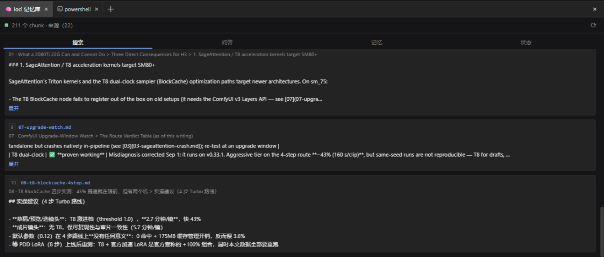
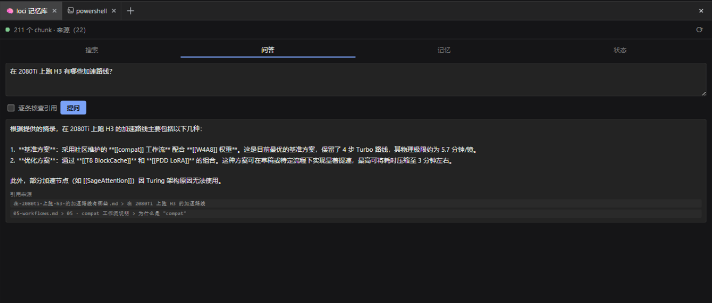
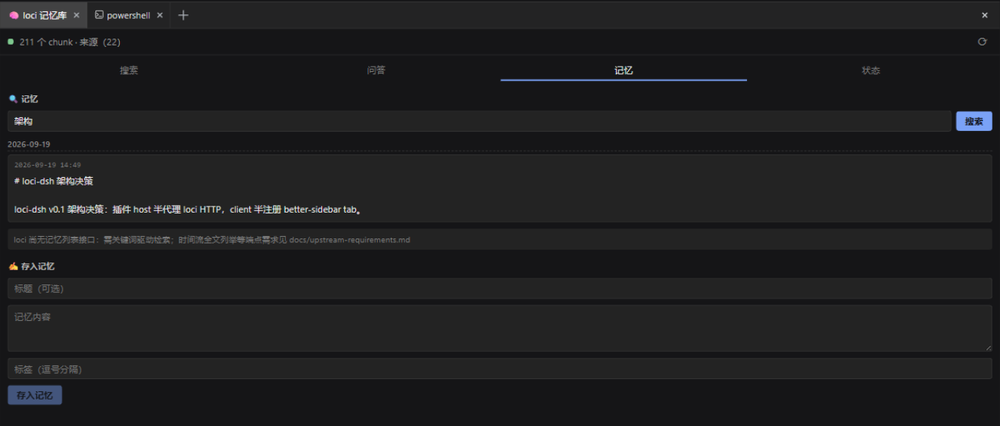
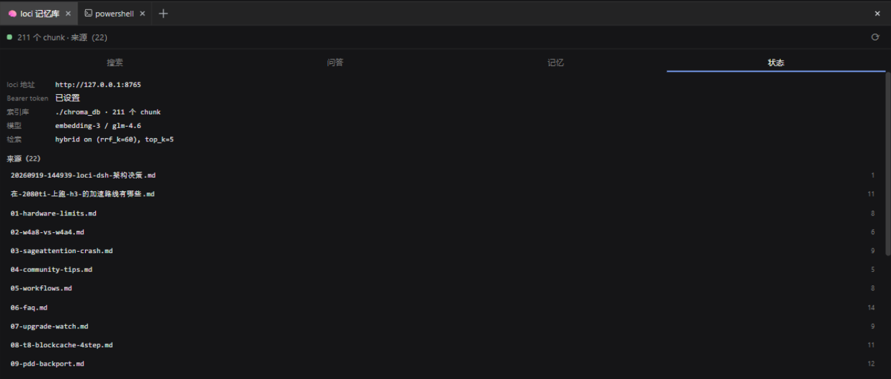
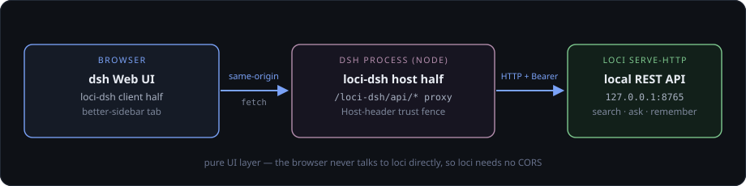

# loci-dsh

> [!TIP]
> 🧠 把 [loci](https://github.com/IvenKooLab/loci) 第二大脑装进 [DeepSeek Harness (dsh)](https://github.com/deepseek-ai/deepseek-harness) 的 Web 侧边栏。
>
> English documentation: [README.md](README.md)

[](https://github.com/0xsline/awesome-deepseek-harness)

**loci-dsh** 是 [dsh](https://github.com/deepseek-ai/deepseek-harness)（"一切皆插件"）的纯 UI 层插件：在 Web 侧边栏挂一个 **🧠 loci 记忆库** 标签页，让你在对话之余直接搜索、提问、速记、查看 [loci](https://github.com/IvenKooLab/loci) 知识库。

| 搜索 | 问答 |
|---|---|
|  |  |
| **记忆** | **状态** |
|  |  |

## 架构

不内嵌 Python、不 fork loci 核心。插件 **host 半**（Node）在 dsh web 服务器上挂载 `/loci-dsh/api/*` 路由，代理转发到本机 [`loci serve-http`](https://github.com/IvenKooLab/loci)（REST + Bearer auth）；**client 半**（React）通过 [dsh-better-sidebar](https://github.com/omdsh-dev/DSH-better-sidebar) 注册侧栏标签页，同源调用 host 半——loci 不需要开 CORS。



- **搜索**：混合检索，支持条数、只看记忆（`tag=memory`）、路径过滤
- **问答**：LLM 基于知识库作答，答案带引用来源芯片，可逐条核查
- **记忆**：关键词检索记忆（按日期分组）+ 快速速记（标题 / 正文 / 标签）
- **图谱**：浏览 loci 知识图谱（loci ≥ 0.6.0 `loci graph build`）：实体芯片带度数角标、SPO 关系行，点选实体即过滤其关系
- **状态**：连接状态、索引库概况、逐来源 chunk 数

loci 的 HTTP API 返回纯文本信封，host 半负责还原结构（搜索块、统计、引用、来自文件名的记忆时间戳），解析器在 [`src/parse.ts`](src/parse.ts)，跟随 loci 的事实线格式。

## 前置条件

1. **Node.js ≥ 24**（dsh 启动器用了 `import.meta.main`，Node 20/22 下 CLI 静默退出）
2. dsh：`npm i -g @deepseek-ai/dsh`
3. 侧边栏底座：`dsh plugin --profile web add dsh-better-sidebar`
4. **loci ≥ v0.6.2** 并启动 HTTP 服务，在 loci 的 `config.toml` 固定 token：

   ```toml
   [http]
   token = "<随便一串随机字符>"
   ```

   ```sh
   loci serve-http   # 默认 127.0.0.1:8765，可用 --host/--port 或 [http] 段覆盖
   ```

## 安装

```sh
# npm（发布后）
dsh plugin --profile web add loci-dsh

# 或直接从 git（lib/ 构建产物已提交，无需本地构建）
dsh plugin --profile web add github:IvenKooLab/loci-dsh
```

然后把插件指向你的 loci 实例。编辑 `~/.dsh/profiles/web/cordis.patch.yml`，加一条**按 id 覆盖的行**（不要用 `insert`——`dsh plugin add` 已把 bundle 挂载了，同 id 再 insert 会因重复条目启动失败）：

```yaml
- id: loci-dsh
  config:
    baseUrl: 'http://127.0.0.1:8765'
    token: '<与 loci config.toml [http] token 相同>'
```

> dsh 的 patch 行对 config 是整行替换（非深合并）——在意的键要全部重述。

也可以在启动 `dsh web` 前设 `LOCI_URL` / `LOCI_TOKEN` 环境变量。

启动 `dsh web`，底部工作台侧栏出现 🧠 **loci 记忆库** 标签。

## 配置项

| 键 | 默认 | 说明 |
|---|---|---|
| `baseUrl` | `http://127.0.0.1:8765` | loci serve-http 地址 |
| `token` | （空） | Bearer token，与 loci `[http] token` 一致 |
| `timeoutMs` | `20000` | 短请求超时（health/stats/search/remember） |
| `askTimeoutMs` | `180000` | `/ask` 超时（LLM 往返，glm-4.6 实测约 21 秒） |
| `graphPath` | （关闭） | loci `graph.json` 的绝对路径（默认 `<store>/graph.json`）——填上即开启图谱视图 |

## 开发

```sh
pnpm install
pnpm build        # tsc 类型检查 + tsdown 双入口打包 → lib/
pnpm watch        # 改动即时重新打包

# 以本地 link 挂进 profile（改完 pnpm build + 浏览器硬刷新生效）
cd ~/.dsh && dsh plugin --profile web add /绝对路径/loci-dsh
```

- `src/index.ts` — host 半：路由挂载、loci 代理、错误映射
- `src/loci-client.ts` — loci HTTP 客户端（fetch + AbortSignal 超时）
- `src/parse.ts` — 纯文本 → 结构化解析（搜索块 / 统计 / 引用）
- `src/trust-fence.ts` — Host 头回环信任围栏（与 dsh `/api` 网关同语义）
- `src/client/` — client 半：标签注册、四个视图、中英词典

结构参照 [dsh-better-sidebar 外部插件指南](https://github.com/omdsh-dev/DSH-better-sidebar/blob/main/docs/external-plugin-guide.md) 与 [dsh-sentinel](https://github.com/fuhefei/dsh-sentinel) 的独立构建。

## 相关项目

- [loci](https://github.com/IvenKooLab/loci) — 本地优先的第二大脑 CLI（`pip install loci-rag`）
- [DeepSeek Harness](https://github.com/deepseek-ai/deepseek-harness) — 本插件扩展的 agent 框架
- [dsh-better-sidebar](https://github.com/omdsh-dev/DSH-better-sidebar) — 承载标签页的侧栏底座

如果 loci-dsh 帮到了你，给仓库点个 ⭐ 让更多人看到。

## License

[MIT](LICENSE)
